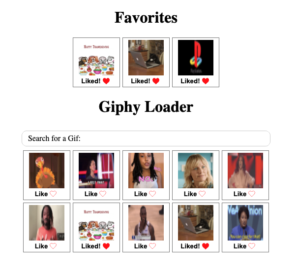

# Giphy API Testing

## Goals

* Test the Giphy API using React.js components
* Use TDD to create all the components of the project
* Practice, practice, practice...

## Stack

* React.js ^17.0.1
* Typescript ^4.0.3
* Sass ^1.28.0
* Unit Test with React Testing Library ^11.1.1
* Jest ^26.6.3
* Webpack ^5.2.0

## Run the project on local
Run npm scripts commands using `npm start`. You will access to the app using `localhost:8080`

## Run test
Run tests scripts commands using `npm test`

## Coding decisions and architecture
* Separated components in visual components and containers
* Container only has logic, also I am using a context to share information between component preventing props drilling
* TDD for all the components, snapshots and focused in user interaction not in component funcionality
* Integration with ESLint and Prettier
* Typescript for better static analysis and posibility of sharing types between components
* Everything simple, no complex tools
* Complete commit description with google standards for git commits
